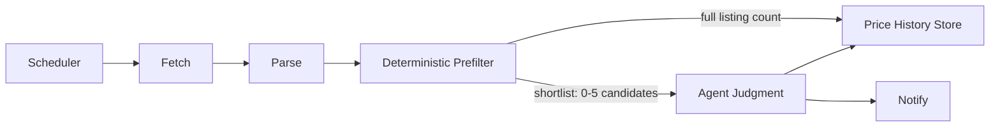

# PriceRadar

A personal Go program that checks whether a specific device (e.g. **MacBook Pro M2 Pro 32GB/512GB**) is listed on [fptshop.com.vn/may-doi-tra](https://fptshop.com.vn/may-doi-tra) — FPT Shop's returned/refurbished device listing — and tracks its price over time.

## How this is built

**This project is built by a human, learning Go.** It exists as a hands-on Go learning vehicle, not a generated codebase, and every line of code is written and understood by its author.

AI is used only in supporting roles, never as the author of the implementation:
- **Structured guide** — a phased, checkpoint-driven learning plan (see [Building Plan](docs/04-building-plan.md)) that introduces one Go concept at a time, in the order the project actually needs it, with "break it / fix it" exercises at each step.
- **Exploration** — researching approaches, tradeoffs, and idiomatic Go before a decision is made.
- **Quality assurance** — reviewing code after it's written, catching mistakes, and suggesting improvements.

The goal is fluency in Go, not a finished artifact shipped as fast as possible.

## Why this exists

- Manually re-checking a listing page for one specific device is tedious and easy to forget.
- The target page is server-rendered and publicly accessible, so it can be checked mechanically without a login or a headless browser.
- The project doubles as a Go learning vehicle: a small, real, end-to-end system (HTTP client → parser → storage → decision logic) built with only the standard library, that grows in scope as Go fluency grows.

## What it does

1. Fetches the listing page(s) on a schedule (not continuously).
2. Parses out every product card (name, price, discount, stock).
3. Deterministically narrows ~650+ listings down to a short list of plausible matches for the target device.
4. Judges the short list against the target spec and price/notify criteria — first with simple rules, later with an AI agent layer for ambiguous naming and "is this worth flagging" judgment.
5. Records every observation in an append-only price-history log (not just "seen/unseen"), so price trend over time is visible.
6. Optionally notifies when the device appears or its price drops meaningfully.

Built as a **single-site product first, multi-site design intent second**: FPT Shop is the only site implemented today, but the site-specific pieces (URL, parsing rules, matching vocabulary) are kept separate from the pieces that never change (scheduling, storage, judgment, notification), so a second site could plug in later without touching the core — see [Solution Architecture § Future Extensibility](docs/02-solution-architecture.md#future-extensibility-not-built-yet).

### What it deliberately does not do (for now)

- No scraping of other retailers or categories — one site, one page, one target spec today.
- No login, no checkout automation, no purchase automation.
- No headless browser / JS rendering — the target page is server-rendered HTML, so this isn't needed.
- No continuous/real-time polling — scheduled, low-frequency checks only.
- No third-party HTTP framework — `net/http` only, by explicit design choice.

## How it works (pipeline)

The system is split into two kinds of responsibility:

| Layer | Owns | Why |
|---|---|---|
| **Deterministic core** (Go) | Fetch, parse, cheap prefiltering, storage | Fast, free, reliable — no ambiguity to resolve |
| **Judgment layer** (AI agent, at runtime) | Resolving ambiguous device-name matches, deciding if a price is worth flagging | Naming variation and "is this a good deal" are contextual, not rule-shaped |

This keeps the expensive/non-deterministic work proportional to actual ambiguity (0–5 candidates), not applied to all ~650 listings on every run. Full detail: [Solution Architecture](docs/02-solution-architecture.md).

## Tech stack

- **Language:** Go, standard library only for HTTP — no framework (no gin/echo/chi).
- **Parsing:** `regexp` (stdlib), zero third-party dependencies.
- **Storage:** `encoding/json`, flat file, no database.
- **Scheduling:** OS-level scheduler (Windows Task Scheduler / cron), not an in-process daemon.

Full detail, including planned package layout: [System Architecture](docs/03-system-architecture.md).

## Usage: the AI Agent runs directly against this repo

PriceRadar is designed to be operated by an AI coding agent (e.g. [Claude Code](https://docs.anthropic.com/en/docs/claude-code)) that runs **inside this repository with direct file access** — the agent reads and writes the project's own files rather than talking to it through a separate API layer.

Concretely, once the CLI exists (see [Status](#status)), a run looks like this:

1. The agent invokes the `priceradar` binary (or, once built, the `cmd/priceradar-mcp` server) directly in this checkout.
2. The CLI emits the current shortlist + price-history diff as JSON — see [`cmd/priceradar` (one-shot CLI)](docs/03-system-architecture.md#cmd-priceradar-one-shot-cli).
3. The agent reads `skill/judgment.md` **from this repo** for the matching/notify rules, and `config.json` for the target device spec and thresholds — it does not receive these as an opaque prompt, it reads the actual files.
4. The agent applies the judgment rules to the shortlist and decides: is there a match, and is it worth flagging.
5. The agent (or the CLI, on the agent's behalf) appends the observation to `price-history.json` in the repo, so history accumulates across runs.
6. If the judgment says so, the agent notifies (chat message, log line, webhook — delivery is decoupled from the decision).

The `cmd/priceradar-mcp` extension ([System Architecture § MCP Extension](docs/03-system-architecture.md#6-mcp-extension-optional)) formalizes this further: it exposes `fetch_listings`, `get_price_history`, and `get_target_config` as MCP tools plus `skill/judgment.md` as an MCP resource, so any MCP-capable agent host can drive the same repo-local pipeline interactively instead of only on a schedule. Either way — CLI JSON or MCP tool calls — the agent's judgment step always runs against this repo's live files, not a copy or a sandboxed API response.

## Compliance posture

- Only the clean listing URL (and plain pagination) is fetched — never the filtered/query-parameter product URLs that `robots.txt` disallows.
- Requests are infrequent (hours between runs, not seconds), with a realistic User-Agent and backoff on errors.

## Status

Early stage — planning only, no code yet. Development follows the phased [Building Plan](docs/04-building-plan.md), starting from a toolchain smoke test and building up one Go concept at a time toward the full pipeline above.

## Docs

- [Project Description](docs/01-project-description.md) — what it is, why it exists, what it deliberately doesn't do.
- [Solution Architecture](docs/02-solution-architecture.md) — the conceptual pipeline and design rationale.
- [System Architecture](docs/03-system-architecture.md) — the concrete Go tech stack, package layout, and deployment shape.
- [Building Plan](docs/04-building-plan.md) — the phased, checkpoint-driven plan for learning Go by building this project.
