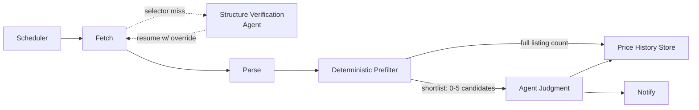

# PriceRadar — Solution Architecture

This document describes the system conceptually: what it's made of, who owns which decision, and how data moves through it. See [System Architecture](03-system-architecture.md) for the concrete Go implementation shape.

## Design principle: mechanical work vs. judgment

The system is deliberately split into two kinds of responsibility:

| Layer | Owns | Why |
|---|---|---|
| **Deterministic core** (Go) | Fetch, parse, cheap prefiltering, storage | Fast, free, reliable — no ambiguity to resolve |
| **Judgment layer** (AI agent) | Resolving ambiguous device-name matches, deciding if a price is worth flagging | Naming variation and "is this a good deal" are contextual, not rule-shaped |

This keeps the expensive/non-deterministic part (an LLM call) proportional to actual ambiguity, not applied to all ~650 listings on every run.

## Hybrid pipeline

### 1. Fetch
Two parts, because the listing page has no URL-based pagination (confirmed empirically — `?trang=`, `?page=`, `?p=` all return the identical first batch):
- The initial batch is a plain HTTP GET against the clean listing URL. Sends a realistic User-Agent, retries with exponential backoff on 429/5xx. Never requests the filtered/query-parameter URLs `robots.txt` disallows.
- The remaining ~627 items are only reachable by repeatedly triggering the page's own client-side "Load more" control, so Fetch drives a headless browser (chromedp) against the same permitted URL, clicking until the control is exhausted. See [System Architecture § Browser Automation](03-system-architecture.md#internalbrowser) for why this, and not the site's internal API or filtered-URL scraping, was chosen.

### 1a. Structure Verification (Agent touchpoint, mechanical)
If the "Load more" control can't be located by its primary (text-content-based) selector, Fetch does not guess or fail hard — it captures a screenshot of the current page state, writes it to disk, and exits with a distinct `needs_agent_review` status (see [System Architecture § CLI contract](03-system-architecture.md#cmdpriceradar-one-shot-cli)). The wrapping Agent — already running the CLI directly against this repo (see the project README) — reads the screenshot, determines the correct selector or next action, and resumes the run.

This is a **different kind of judgment** than step 4 below: it's about whether the scraping mechanism itself still matches reality (mechanical/structural), not about the business question of which product matches the target. Both share the same shape — Go emits a structured "I can't decide this deterministically" signal, the Agent (with repo/file access, not a live API call from inside Go) resolves it, then hands control back — but they sit at different points in the pipeline and answer different questions.

A future, formalized version of this hand-off is planned as an MCP tool (`verify_page_structure`) once the [MCP Extension](#extension-point-mcp) exists — not built now, since the exit-code/JSON hand-off already works and MCP is itself deferred.

### 2. Parse
Turns raw HTML into a list of `Product` records: name, current price, original price, discount %, stock indicator, product URL. Parsing is per-card and fault-isolated — one malformed card doesn't abort the run, since the target page is server-rendered (no JS execution required).

### 3. Deterministic Prefilter
Cheap token-overlap scoring narrows the full listing (~650 items) down to a short list of plausible matches for the target spec, biased toward **recall over precision**:
- **Hard exclude** — obvious category mismatches (target says "macbook", listing says "iphone") are dropped outright.
- **Soft include** — anything with meaningful token overlap is kept, even if imperfect, because the next layer (the agent) is better equipped to resolve fine-grained ambiguity (chip generation, RAM/storage order, "Demo"/refurb labels) than more regex would be.

Output per candidate: name, price, discount, stock, URL, overlap score, matched/missing tokens.

### 4. Agent Judgment
Given the short list, the price history for any already-tracked candidate URL, and a written instructions file (matching rules + notify rules), the agent:
- Decides which candidate (if any) is genuinely the target device.
- Decides whether the current price/discount/trend is worth flagging.
- Produces a verdict with a stated reason, so decisions stay auditable even though they aren't hardcoded.

Only the short list (typically 0–5 items) is ever handed to the agent — not the full catalog — to keep latency and cost proportional to actual ambiguity.

### 5. Price History Store
An append-only, timestamped log of every observation per product URL (price, discount, stock), regardless of whether the agent judged it a match this run. This is a **history log, not a dedup filter** — the goal is visibility into price trend over time, not "seen once, skip."

### 6. Notify
Fires only when the agent's judgment says so (new match, price drop, price below threshold). Delivery channel is decoupled from the decision — a log line, a webhook post, or a chat message are equally valid.

## Extension point: MCP
The same deterministic core (fetch → parse → prefilter → store) can be exposed as an MCP server in addition to running as a scheduled one-shot batch job, so any MCP-capable agent host can call it interactively rather than only on a timer. This is additive — it does not change the pipeline above, only how it's invoked. See [System Architecture § MCP Extension](03-system-architecture.md#6-mcp-extension-optional) for the concrete shape. The Structure Verification hand-off (§1a above) is expected to become one of these MCP tools eventually (`verify_page_structure`) — deferred alongside the rest of the MCP extension, not built now.

## Why this shape, not simpler
- **Why not one Go program that also decides notify?** — Because "does this listing match a loosely-specified target" and "is this price worth flagging" are exactly the kind of judgment calls that break brittle regex/threshold rules whenever the site's naming conventions shift slightly. A hard rule set has to be exhaustively pre-anticipated; an agent given clear instructions can adapt without new code being shipped.
- **Why not run the agent over every listing?** — Cost and latency scale with catalog size for no benefit; the prefilter already does the "is this even plausible" work cheaply and deterministically.
- **Why keep history append-only rather than dedup?** — The point of a price *checker* is the trend, not just presence/absence.
- **Why hand Structure Verification back to the wrapping Agent instead of calling an LLM API from inside Go?** — The CLI is already designed to be run by an Agent with direct access to this repo (see the project README's Usage section). Reusing that existing hand-off — Go emits a structured signal and exits, the Agent reads a file and resumes — needs zero new dependencies (no API client, no key management) inside the deterministic core. A live in-process API call was considered and rejected for now: it would duplicate a channel that already exists.

## Future extensibility (not built yet)

Today there is exactly one site (FPT Shop). The pipeline is deliberately drawn so that **only two boxes know the site exists**; everything else in the flow above is already site-agnostic in shape, even though it currently only has one input:

| Pipeline stage | Site-specific today? | Why / what would change to add a second site |
|---|---|---|
| Fetch | Yes — one hardcoded URL + pagination shape | Would become "one fetch config per site" (base URL, pagination pattern, allowed vs. disallowed paths per that site's `robots.txt`) |
| Parse | Yes — regex patterns are shaped around FPT Shop's markup | Would become "one parser per site" behind a shared `Product`-shaped output — the rest of the pipeline never needs to know a listing came from a different site |
| Deterministic Prefilter | No — token-overlap scoring is already generic string logic | Unchanged; works the same regardless of source, as long as input is the shared `Product` shape |
| Agent Judgment | No — instructions are about the *target device*, not the site | Unchanged; the judgment file already reasons over listings generically |
| Price History Store | No — keyed by product URL, source-agnostic | Unchanged; a second site's products just become more keys in the same store |
| Notify | No | Unchanged |

**The concrete extension point, when it's actually needed:** introduce a small per-site interface — "given a target spec, return `Product[]`" — with FPT Shop as the first implementation. Fetch + Parse are the only stages that move behind that interface; Prefilter, Judgment, Store, and Notify stay exactly as they are. This is intentionally *not* built now — adding the abstraction before a second real site exists would be guessing at a shape that only becomes clear once there's a second concrete case to generalize from.
