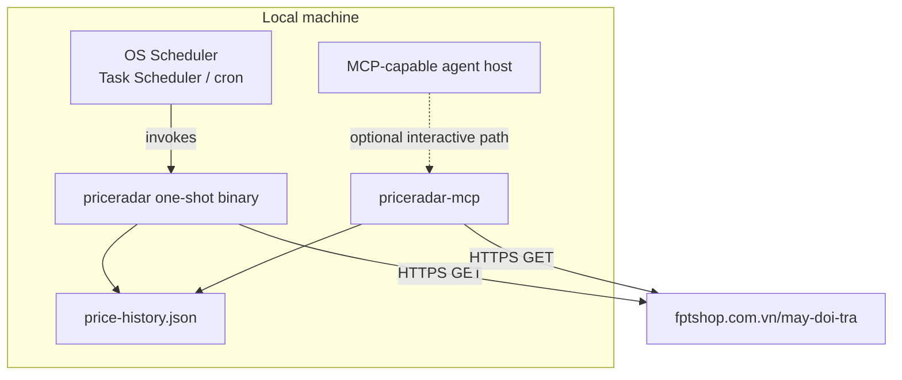

# PriceRadar — System Architecture (Go)

Concrete tech stack and structure. Companion to [Solution Architecture](02-solution-architecture.md), which covers the conceptual pipeline this implements.

## Tech stack constraints
- **Language:** Go, standard library only for HTTP — **no HTTP framework** (no gin/echo/chi). `net/http` for both client and (later, MCP) server transport.
- **Parsing:** `regexp` (stdlib) — zero third-party dependencies, consistent with the zero-dependency pattern already used elsewhere in this workspace's scraper CLIs. (`golang.org/x/net/html` is a fallback option if regex proves too fragile against markup drift — a deliberate tradeoff to revisit only if needed.)
- **Storage:** `encoding/json`, flat file, no database.
- **Scheduling:** OS-level scheduler (Windows Task Scheduler / cron), not an in-process daemon.

## Module layout

```
priceradar/
  cmd/
    priceradar/            # one-shot CLI entrypoint (default, scheduler-invoked)
      main.go
    priceradar-mcp/         # optional MCP server entrypoint (extension)
      main.go
  internal/
    httpclient/             # net/http.Client wrapper: UA header, timeout, retry/backoff
    parser/                 # HTML -> []Product via regexp
    prefilter/              # token-overlap scoring -> ShortList
    store/                  # JSON price-history read/append
    model/                  # shared structs: Product, Snapshot, Candidate, Target
  skill/
    judgment.md             # agent instructions: matching rules, notify rules, output contract
  config.json                # target device spec(s), listing URL, notify thresholds
  price-history.json          # generated at runtime — append-only snapshot log
```

## Component detail

### `internal/httpclient`
- One `*http.Client` built once, `Timeout` set explicitly (e.g. 15s).
- Custom `http.RoundTripper` wrapping `http.DefaultTransport`, solely to inject a realistic desktop User-Agent header — the idiomatic stdlib substitute for HTTP client "middleware."
- Retry loop (plain `for`, not a library) around `client.Do(req)`: exponential backoff with cap on network errors / 429 / 5xx; anything else propagates as an error.
- Requests built via `http.NewRequestWithContext`, so a `context.WithTimeout` at the call site bounds total run time.

### `internal/parser`
- Per-product-card regex extraction into `model.Product{Name, URL, Price, OriginalPrice, DiscountPct, InStock, FetchedAt}`.
- Fault-isolated: a single card's parse failure is logged and skipped, not fatal to the run.

### `internal/prefilter`
- Tokenizes target spec and each product name identically (lowercase, split on whitespace/hyphen).
- Hard-exclude list for category mismatches (cheap, safe — never a false negative risk).
- Score = matched tokens / total target tokens; soft-include threshold biased toward recall.
- Output: `model.Candidate{Product, Score, MatchedTokens, MissingTokens}`.

### `internal/store`
- `map[string][]model.Snapshot]` keyed by product URL, `encoding/json` marshal/unmarshal.
- Atomic write: serialize to a temp file, then `os.Rename` over the target — avoids partial writes if the process is interrupted mid-write.

### `cmd/priceradar` (one-shot CLI)
Straight-line `main()`, no goroutines required for a single-page run:
1. Load `config.json`.
2. Fetch + parse (paginate if needed — see concurrency note below).
3. Prefilter → shortlist.
4. Print shortlist + history diff as JSON to stdout (for the agent layer to consume) and/or hand off directly to an in-process judgment call.
5. Append new snapshots to `price-history.json`.

Exit code and stderr follow the same convention as this workspace's other scraper CLIs: JSON to stdout on success, `{error, code}` to stderr with non-zero exit on failure.

### Concurrency (only if pagination is needed)
If the listing spans multiple pages, fetch them concurrently with a small `sync.WaitGroup` + goroutines over `internal/httpclient` — still stdlib-only, no `errgroup` dependency required unless cleaner error aggregation becomes worth the tradeoff later.

### 6. MCP Extension (optional)
A second entrypoint, `cmd/priceradar-mcp`, exposes the same `internal/*` packages as MCP tools/resources rather than a CLI:

| MCP surface | Backed by | Purpose |
|---|---|---|
| Tool `fetch_listings` | `httpclient` + `parser` + `prefilter` | Run one fetch cycle, return shortlist + total scanned count |
| Tool `get_price_history(url)` | `store` | Return snapshot history for one product URL |
| Tool `get_target_config` | `config.json` | Return configured target spec(s) + notify thresholds |
| Resource `judgment-instructions` | `skill/judgment.md` | Serve the judgment criteria so any MCP host loads it automatically |

- **Transport:** stdio — this is a local, personal-use tool; no network exposure, no auth surface.
- **Adapter-only impact:** `cmd/priceradar-mcp/main.go` is a thin translation layer over the existing `internal/*` packages. None of the core packages need to know MCP exists — this is what makes the extension additive rather than a rewrite.

## Deployment shape



Both entrypoints share the same `internal/*` core and the same `price-history.json` file — the scheduled batch path and the interactive MCP path are two doors into one system, not two systems.

## Future extensibility: where a second site would plug in (not built yet)

Per [Solution Architecture § Future Extensibility](02-solution-architecture.md#future-extensibility-not-built-yet), only `internal/httpclient` + `internal/parser` are site-specific today. Concretely, when a second site becomes real (not before):

```
internal/
  sites/
    fptshop/                # today's httpclient+parser logic moves here unchanged
      fetch.go
      parse.go
    <secondsite>/            # new site, same shape, own fetch.go/parse.go
  siteplugin/                 # the interface both above satisfy: Fetch(target) -> []model.Product
  prefilter/                  # unchanged — already site-agnostic
  store/                      # unchanged — keyed by product URL, not by site
  model/                      # unchanged
```

`config.json` would gain a `site` field per target so the CLI knows which `siteplugin` implementation to invoke; everything downstream of `[]model.Product` — prefilter, judgment, store, notify — needs no changes at all. This restructuring is a Phase-10-or-later concern in the [Building Plan](04-building-plan.md), deliberately deferred until a second real site justifies the abstraction.
