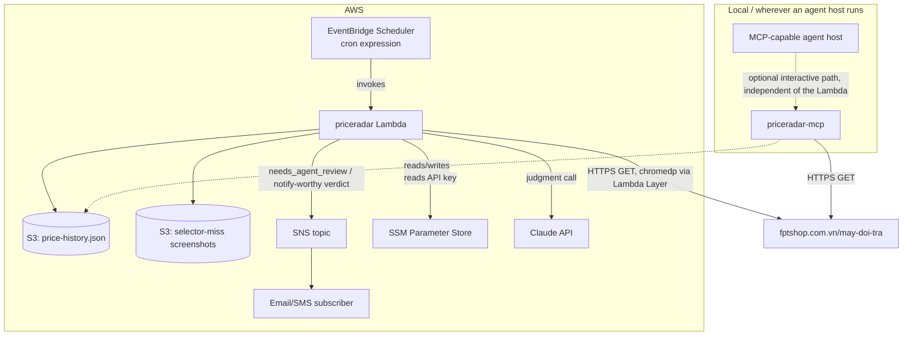

# PriceRadar — System Architecture (Go)

Concrete tech stack and structure. Companion to [Solution Architecture](02-solution-architecture.md), which covers the conceptual pipeline this implements.

## Tech stack constraints
- **Language:** Go, standard library only for HTTP — **no HTTP framework** (no gin/echo/chi). `net/http` for the site fetch, the Claude API call in `internal/judge`, and (later, MCP) server transport.
- **Parsing:** `regexp` (stdlib) — zero third-party dependencies, consistent with the zero-dependency pattern already used elsewhere in this workspace's scraper CLIs. (`golang.org/x/net/html` is a fallback option if regex proves too fragile against markup drift — a deliberate tradeoff to revisit only if needed.)
- **Browser automation:** [`chromedp`](https://github.com/chromedp/chromedp) — a deliberate, scoped exception to the zero-third-party-dependency stance. Needed because the listing's full ~650-item catalog has no URL-based pagination (verified empirically — `?trang=`, `?page=`, `?p=` all return the identical first batch) and no compliant alternative: the site's internal API (`papi.fptshop.com.vn`) is undocumented and unstable, and the filtered/query-parameter URLs that would otherwise narrow results are explicitly disallowed by `robots.txt`. Driving the page's own "Load more" control via chromedp fetches the same permitted URL a real user would, just automated. Chosen over `go-rod` and `playwright-go` for largest community + most active maintenance + no separate driver-install step (pure Go, CDP-based, only needs a Chrome/Chromium binary — see Lambda packaging below for how that binary gets into the execution environment).
- **AWS integration:** `aws-sdk-go-v2` (S3 + SNS clients only) and `aws-lambda-go` (the Lambda runtime shim) — sanctioned, narrowly-scoped dependencies for the deployment target, same treatment as chromedp: justified by a concrete requirement (S3 object storage, SNS notifications, Lambda's handler contract), not a general license for more AWS SDK usage.
- **Judgment-layer LLM calls:** the Claude API (Messages endpoint), called directly via `net/http` from `internal/judge` — no SDK, since it's a single request/response call with no streaming need. Scoped to that one package; see ADR-010.
- **Storage:** `encoding/json`, one JSON object, no database — the object lives in S3 instead of on local disk (see ADR-007).
- **Scheduling:** AWS EventBridge Scheduler invoking the Lambda function on a cron expression, not an in-process daemon and not an OS-level scheduler (see ADR-006 — this supersedes the original OS-scheduler decision because there's no always-on machine to host Task Scheduler/cron).

## Module layout

```
priceradar/
  cmd/
    priceradar/            # Lambda handler entrypoint (default, EventBridge Scheduler-invoked)
      main.go                 # lambda.Start(handler) wrapper; handler logic extracted into a plain, locally-testable run()
    priceradar-mcp/         # optional MCP server entrypoint (extension)
      main.go
  internal/
    httpclient/             # net/http.Client wrapper: UA header, timeout, retry/backoff
    browser/                # chromedp wrapper: navigate, click "Load more" loop, screenshot-on-selector-miss (uploads to S3)
    parser/                 # HTML -> []Product via regexp
    prefilter/              # token-overlap scoring -> ShortList
    store/                  # JSON price-history read/append, backed by a single S3 object (GetObject/PutObject)
    judge/                   # Claude API client: shortlist + skill/judgment.md -> verdict, called in-process by the handler
    notify/                  # verdict/alert delivery: log line (default) + SNS
    model/                  # shared structs: Product, Snapshot, Candidate, Target
  skill/
    judgment.md             # judgment-layer instructions: matching rules, notify rules, output contract; embedded via go:embed
  config.json                # target device spec(s), listing URL, notify thresholds, S3 bucket/key, SNS topic ARN
```

`price-history.json` and selector-miss screenshots are no longer local files generated at runtime — they live in S3 (see Component detail below). Lambda's own filesystem (`/tmp`, 512MB–10GB depending on config) is used only as scratch space during a single invocation, never for anything that needs to survive past it.

## Component detail

### `internal/httpclient`
- One `*http.Client` built once, `Timeout` set explicitly (e.g. 15s).
- Custom `http.RoundTripper` wrapping `http.DefaultTransport`, solely to inject a realistic desktop User-Agent header — the idiomatic stdlib substitute for HTTP client "middleware."
- Retry loop (plain `for`, not a library) around `client.Do(req)`: exponential backoff with cap on network errors / 429 / 5xx; anything else propagates as an error.
- Requests built via `http.NewRequestWithContext`, so a `context.WithTimeout` at the call site bounds total run time.

### `internal/browser`
- Owns a single chromedp browser context for the run — navigates to the clean listing URL, then loops: find the "Load more" control, click it, wait for new cards to render, repeat until the control is gone or the reported total is reached.
- **Selector strategy: text-content match, not CSS class.** The control's actual markup has no stable `id`/class (only Tailwind utility classes that regenerate on every frontend rebuild) — so the primary selector targets the visible text ("Xem thêm") via an XPath-style query, not styling classes, to survive markup churn.
- **On selector miss (mechanical fault, not a hard error):** captures a full-page screenshot via chromedp's screenshot action (the browser context is already open at this point, so this is nearly free), writes it to Lambda's ephemeral `/tmp` first, then uploads it to the S3 bucket/prefix from `config.json` and surfaces a `needs_agent_review` result up to the handler instead of panicking or silently returning a partial list. See the handler contract below for how this becomes a non-error `needs_agent_review` response.
- This package is the only one that knows a headless browser exists — `parser` still consumes plain HTML text regardless of whether it came from `httpclient` (initial batch) or `browser` (full catalog after all clicks).
- **Running chromedp inside Lambda:** the execution environment has no Chrome/Chromium preinstalled, so the deployment needs a headless-Chromium Lambda Layer (a `sparticuz/chromium`-style prebuilt, Lambda-sized layer — full desktop Chrome builds are too large for Lambda's package limits). Launch chromedp with the layer's binary path and the flags that build typically documents for sandboxed containers (`--no-sandbox`, `--single-process`, `--disable-gpu`, etc.). Budget generously on memory (~1024MB+) since Chromium plus Go runtime plus rendered DOM adds up, and keep the Lambda timeout comfortably above the observed "click through ~13 batches of Load more" duration (a few minutes) while staying well under Lambda's 15-minute hard cap.

### `internal/judge`
- The one package that calls the Claude API — scoped as narrowly as chromedp is scoped to `internal/browser`, for the same reason: a deliberate, justified exception to an otherwise strict boundary (see ADR-010).
- Input: the shortlist from `internal/prefilter`, the price history for any already-tracked candidate URL (from `internal/store`), and `skill/judgment.md`'s instructions (embedded into the binary via `go:embed` so the deployed Lambda package always carries the instructions it was built with).
- Calls the Claude Messages API over `net/http` with these as context; parses the response into a verdict matching the output contract in `skill/judgment.md` (matched URL or none, confidence, one-line reason).
- The Claude API key is read from an environment variable populated by an SSM Parameter Store `SecureString` (free, unlike Secrets Manager's per-secret charge) — never hardcoded or committed to `config.json`.
- Runs synchronously within the same Lambda invocation, after prefiltering and before store/notify — no external round trip, no separate CLI invocation by a wrapping agent.

### `internal/notify`
- Fires only when `internal/judge`'s verdict says so (new match, price drop, price below threshold).
- Default channel: a structured log line (visible in CloudWatch Logs, zero additional config). AWS-native channel: publish to an SNS topic (ARN from `config.json`) for email/SMS/webhook fan-out via SNS subscriptions.
- Also the channel used for the selector-miss alert from `internal/browser` (same SNS topic, different message shape) — see ADR-009.

### `internal/parser`
- Per-product-card regex extraction into `model.Product{Name, URL, Price, OriginalPrice, DiscountPct, InStock, FetchedAt}`.
- Fault-isolated: a single card's parse failure is logged and skipped, not fatal to the run.

### `internal/prefilter`
- Tokenizes target spec and each product name identically (lowercase, split on whitespace/hyphen).
- Hard-exclude list for category mismatches (cheap, safe — never a false negative risk).
- Score = matched tokens / total target tokens; soft-include threshold biased toward recall.
- Output: `model.Candidate{Product, Score, MatchedTokens, MissingTokens}`.

### `internal/store`
- `map[string][]model.Snapshot]` keyed by product URL, `encoding/json` marshal/unmarshal — same shape as the original design.
- Backed by a single S3 object (bucket/key from `config.json`): `GetObject` the current history (missing key → empty map, not an error), append new snapshots in memory, `PutObject` the whole object back.
- No temp-file/`os.Rename` dance to replicate — S3 already serves either the old or the new object to any reader, never a partial write, so a whole-object `PutObject` is already atomic from a reader's perspective (see ADR-007). This does mean two concurrent invocations could race (read-modify-write), which is accepted because EventBridge Scheduler invokes this Lambda on a single non-overlapping schedule — there is exactly one writer at a time by construction.

### `cmd/priceradar` (Lambda handler)
Straight-line handler logic, no goroutines required for a single-page run — but the core logic is extracted into a plain `run(ctx, cfg) (Response, error)` function so it's testable without spinning up a Lambda runtime, and `main.go` is a thin `lambda.Start(handler)` wrapper around it:
1. Load `config.json` (bundled into the deployment package).
2. Fetch initial batch (`httpclient`) + drive `browser` to load the full catalog.
3. Parse the resulting HTML.
4. Prefilter → shortlist.
5. Judgment (`internal/judge` calls the Claude API with the shortlist) → verdict.
6. Append new snapshots (and the verdict) to the S3-backed price history (`internal/store`).
7. Notify (`internal/notify`) if the verdict says so.
8. Return the response.

**Handler outcome contract** — a three-way outcome, not just success/failure, adapted from the original CLI exit-code design to Lambda's `(response, error)` shape:

| Outcome | Handler return | Meaning |
|---|---|---|
| Success | `(Response{shortlist, since_last_run, verdict}, nil)` | Normal run |
| Hard error | `(nil, err)` | Network/config/store failure — Lambda records an invocation error; EventBridge's configured retry policy may retry, and an on-failure destination (SNS) can alert once retries are exhausted |
| `needs_agent_review` | `(Response{status: "needs_agent_review", step: "load_more_detection", reason: "primary_selector_not_found", screenshot_url: "<S3 URL>", dom_candidates: [...]}, nil)` | `internal/browser` couldn't locate the "Load more" control by its primary selector |

`needs_agent_review` is a deliberate third state, not a variant of the error path: it means the deterministic core *correctly* recognized it couldn't decide something mechanical (has the site's markup changed?) and stopped rather than guessing. It's returned as a **successful** invocation (`nil` error) — not a Lambda error — because retrying immediately won't fix a broken selector, and letting Lambda's automatic retry policy fire on this would just repeat the same miss. Instead the handler itself uploads the screenshot to S3 and publishes the SNS notification before returning. A human or an agent session reviews it later, decides the correct selector, and ships the fix as a normal commit + redeploy — not a runtime-read override (see ADR-009). `internal/judge` is not involved in this path at all: this is a scraping-mechanism decision, not the shortlist/product-matching judgment.

### Concurrency (only if pagination is needed)
If the listing spans multiple pages, fetch them concurrently with a small `sync.WaitGroup` + goroutines over `internal/httpclient` — still stdlib-only, no `errgroup` dependency required unless cleaner error aggregation becomes worth the tradeoff later.

### IAM / permissions
The Lambda execution role should be scoped to exactly what it needs, not broad wildcards: `s3:GetObject`/`s3:PutObject` on the specific price-history key and screenshot prefix, `sns:Publish` on the specific notification topic ARN, and `ssm:GetParameter` on the specific parameter holding the Claude API key. No other AWS resource access is needed.

### 6. MCP Extension (optional)
A second entrypoint, `cmd/priceradar-mcp`, exposes the same `internal/*` packages as MCP tools/resources rather than a CLI:

| MCP surface | Backed by | Purpose |
|---|---|---|
| Tool `fetch_listings` | `httpclient` + `parser` + `prefilter` | Run one fetch cycle, return shortlist + total scanned count |
| Tool `get_price_history(url)` | `store` | Return snapshot history for one product URL |
| Tool `get_target_config` | `config.json` | Return configured target spec(s) + notify thresholds |
| Resource `judgment-instructions` | `skill/judgment.md` | Serve the judgment criteria so any MCP host loads it automatically |
| Tool `verify_page_structure(screenshot)` *(future)* | `browser` | Formalized version of the `needs_agent_review` hand-off — lets an MCP host resolve a selector-miss interactively instead of via the async S3+notify loop. Not built now: that hand-off already covers this, and building the tool early would front-run the rest of this optional extension. |

- **Transport:** stdio — this runs locally (wherever an MCP-capable agent host is), independent of the Lambda deployment; no network exposure, no auth surface.
- **Adapter-only impact:** `cmd/priceradar-mcp/main.go` is a thin translation layer over the existing `internal/*` packages, reading/writing the same S3-backed `store`. None of the core packages need to know MCP exists — this is what makes the extension additive rather than a rewrite.

## Deployment shape



The scheduled Lambda path and the optional interactive MCP path share the same `internal/*` core and the same S3-backed price history — two doors into one system, not two systems — but only the Lambda path runs on a schedule; MCP is invoked on demand by whatever host is running it.

## Future extensibility: where a second site would plug in (not built yet)

Per [Solution Architecture § Future Extensibility](02-solution-architecture.md#future-extensibility-not-built-yet), only `internal/httpclient` + `internal/parser` are site-specific today. Concretely, when a second site becomes real (not before):

```
internal/
  sites/
    fptshop/                # today's httpclient+parser logic moves here unchanged
      fetch.go
      parse.go
    <secondsite>/            # new site, same shape, own fetch.go/parse.go
  siteplugin/                 # the interface both above satisfy: Fetch(target) -> []model.Product
  prefilter/                  # unchanged — already site-agnostic
  store/                      # unchanged — keyed by product URL, not by site
  model/                      # unchanged
```

`config.json` would gain a `site` field per target so the CLI knows which `siteplugin` implementation to invoke; everything downstream of `[]model.Product` — prefilter, judgment, store, notify — needs no changes at all. This restructuring is deliberately deferred until a second real site justifies the abstraction.
